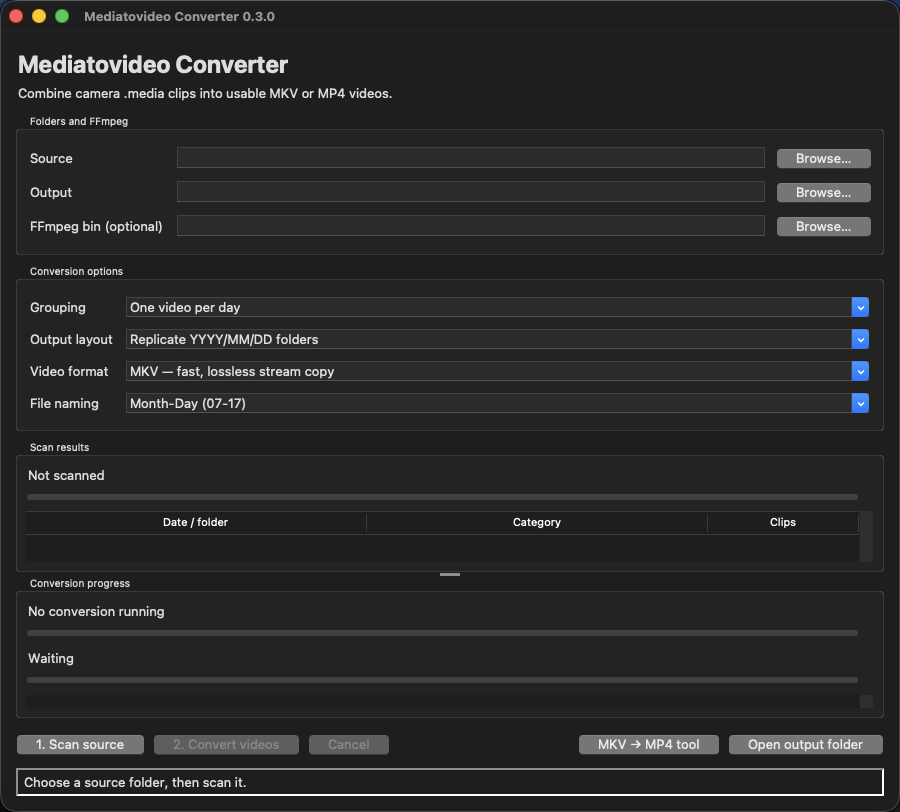
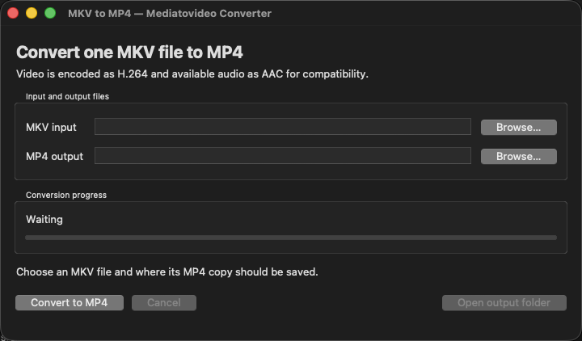

# Mediatovideo Converter

Mediatovideo Converter is a simple Windows and macOS desktop application for
combining camera `.media` clips into usable video files. It expands the
[original FFmpeg concat gist](https://gist.github.com/priintpar/f7a56af8977206e9f45b486f767b02ac)
with folder-aware grouping, validation, progress reporting, cancellation, and a
graphical interface.

## Real application screenshots

These are screenshots of the actual macOS application, not interface renders.
The Windows application has the same controls with native Windows styling. The
screenshots were taken with empty fields and contain no user folders, filenames,
media, video frames, or photographs.





## What the application does

Mediatovideo Converter has two workflows:

1. **Folder conversion** recursively finds camera `.media` clips, organises
   them by date and optional child folder, then joins each group into an MKV or
   MP4 video.
2. **Single-file conversion** takes an existing MKV and creates a compatible
   H.264/AAC MP4.

All video processing happens locally with FFmpeg. Nothing is uploaded. The
first-run installer only uses the internet when a required component is
missing.

## Folder conversion: step by step

1. Start the native launcher for the operating system. It checks Python,
   Tkinter, FFmpeg, and FFprobe before opening the app.
2. Choose a **Source** folder containing `.media` files. The app suggests a
   `Converted Videos` folder beside the selected source, which can be changed.
3. Choose the grouping, output layout, video format, and filename style.
4. Click **1. Scan source**. The app shows scan activity, the dates/categories
   it found, clip counts, and the number of videos it will create.
5. Review the scan table, then click **2. Convert videos**.
6. Follow the overall and current-video progress bars, status text, and activity
   log. When complete, click **Open output folder**.

Changing the source or grouping after a scan invalidates the old preview, so
the app clearly asks for another scan before conversion.

## How folders are discovered and grouped

The scanner recognises `YYYY/MM/DD` anywhere below the selected source. This
means the source can be one day folder such as `DCIM/2026/07/17`, the year
folder, `DCIM`, or a higher camera-export folder containing several dates.

For this example:

```text
DCIM/
└── 2026/
    └── 07/
        └── 17/
            ├── Camera 1/
            │   ├── clip-001.media
            │   └── clip-002.media
            └── Camera 2/
                └── clip-001.media
```

- **One video per day** joins all three clips into one video for `2026/07/17`.
- **One video per child folder in each day** makes one video for `Camera 1` and
  one for `Camera 2`. A file placed directly in `17` is put in a `Day root`
  category.

Files outside a recognised date tree are still usable. They are grouped under
the selected source folder, and the scan log reports that their date path was
not recognised. `.media` matching is case-insensitive, and clips are joined in
stable full-relative-path order.

## Every main-window control

| Control | Function |
| --- | --- |
| **Source** | Folder recursively searched for `.media` clips. |
| **Output** | Root folder for completed MKV or MP4 files. Missing date subfolders are created automatically. |
| **FFmpeg bin (optional)** | Manual override for the folder containing both `ffmpeg` and `ffprobe`; normally leave blank to use the installed tools. |
| **Grouping** | Creates one video per date, or one per immediate child folder inside each date. |
| **Output layout** | Recreates `YYYY/MM/DD` below the output folder, or writes every video into one flat folder. |
| **Video format** | Chooses fast MKV stream copy or H.264/AAC MP4 encoding. |
| **File naming** | Chooses `Month-Day` or `Month-Day-Category` filenames. |
| **Scan results** | Previews each date/folder, category, and clip count before any video is written. |
| **Conversion progress** | Shows overall videos, current clip validation/encoding, and a scrolling activity log. |
| **1. Scan source** | Starts a responsive recursive scan and acknowledges scan/cancel/error states. |
| **2. Convert videos** | Starts conversion only after a successful scan and valid output selection. |
| **Cancel** | Requests a safe stop for the active scan or conversion. |
| **MKV → MP4 tool** | Opens the independent single-file converter. |
| **Open output folder** | Opens the selected destination in Finder or File Explorer. |

## Output layout and filenames

With the example date and category above, the choices produce paths like:

| Layout | Naming | Example output |
| --- | --- | --- |
| Replicate dates | Month-Day | `Output/2026/07/17/07-17.mkv` |
| Replicate dates | Month-Day-Category | `Output/2026/07/17/07-17-Camera 1.mkv` |
| Flat folder | Month-Day | `Output/07-17.mkv` |
| Flat folder | Month-Day-Category | `Output/07-17-Camera 1.mkv` |

The category suffix is available when child-folder grouping produces a
category. Characters that are invalid in Windows/macOS filenames are replaced.
The application never overwrites an existing video: if a name already exists,
it safely creates `-2`, `-3`, and so on.

## MKV or MP4 output

**MKV — fast, lossless stream copy** follows the original Gist. It copies the
camera streams without decoding or re-encoding, so it is fast and does not lose
quality. The clips must contain streams and timestamps that FFmpeg can join.
If stream copy cannot join a group, the app recommends trying MP4.

**MP4 — compatible H.264 (slower)** decodes and re-encodes the first available
video and audio streams with H.264 (`libx264`, CRF 20, medium preset) and AAC
(128 kbit/s). It adds fast-start metadata for easier playback. Re-encoding is
slower and lossy, but it can handle many clip/timestamp differences that stream
copy cannot.

A proprietary, damaged, or unrecognised camera stream cannot be repaired merely
by changing its container. The source export must still contain readable media.

## Scanning, progress, cancellation, and safety

- The scan runs outside the UI thread and continuously shows the folder being
  inspected. A completed scan reports clip, day, and planned-video counts.
- Every clip is checked with FFprobe before conversion. Unreadable clips are
  skipped, named in the activity log, and included in the final summary.
- The overall bar tracks video groups. The current bar first tracks validation,
  then FFmpeg encoding time. If duration is unavailable, an animated progress
  bar still shows that work is continuing.
- The status bar and log acknowledge selections, cancelled dialogs, active
  operations, successful outputs, skipped clips, and failures.
- **Cancel** immediately changes the visible status, stops the worker safely,
  keeps already completed videos, and removes the current partial output.
- Outputs are written to a hidden partial file and atomically renamed only after
  FFmpeg succeeds. Existing outputs are never overwritten.
- Accidental window closing during work asks whether the operation should be
  cancelled before exiting.

## Clear error reporting

Input, installer, filesystem, FFmpeg, and unexpected errors are shown with:

- **Stage** — what the app was doing;
- **Problem** — a plain-language explanation;
- **What to do** — the next recovery action;
- **Technical detail** — the relevant path, system message, or FFmpeg detail.

Common cases such as a disconnected source drive, unwritable output folder,
full drive, missing H.264 encoder, unreadable clip, timestamp mismatch, and
missing FFmpeg tools have specific recovery guidance. A failed group does not
silently stop other planned groups.

## Automatic first-run setup

The application requires Python 3.9 or newer with Tkinter, FFmpeg, and FFprobe.
The native launchers check these components on every start and install only what
is missing. An internet connection may be required on the first run.

### Windows

Double-click `run_windows.bat`. A terminal remains visible and explains every
check, installation, verification, and error. Missing components are installed
with Windows Package Manager (WinGet):

- the official Python install manager and Python 3.14 with Tkinter;
- the `Gyan.FFmpeg` package, including FFmpeg and FFprobe.

WinGet is included with supported Windows 10 and Windows 11 systems through
Microsoft App Installer. If WinGet is unavailable, the launcher explains how to
install or update App Installer before continuing.

### macOS

Double-click `run_macos.command`. Its Terminal window checks each component and
keeps all installation progress and errors visible. It uses a compatible
existing Python when possible. Otherwise it installs Homebrew, then the
`python-tk` formula. Missing FFmpeg tools are installed with Homebrew.

Homebrew installation may request the Mac administrator password and explains
what it will change before continuing.

### Manual fallback

The same dependencies can be installed manually. On macOS with Homebrew:

```sh
brew install python-tk
brew install ffmpeg
```

On Windows with WinGet and Python's install manager:

```powershell
winget install 9NQ7512CXL7T -e --accept-package-agreements
py install 3.14
winget install --id Gyan.FFmpeg -e
```

Restart the terminal after installation. If FFmpeg is not on the system path,
use the app's optional **FFmpeg bin** selector to choose the folder containing
`ffmpeg` and `ffprobe` (`.exe` on Windows).

## Run from source

On macOS, double-click `run_macos.command`. To bypass the prerequisite launcher
after everything is installed, run:

```sh
python3 run_app.py
```

On Windows, double-click `run_windows.bat`. To bypass the prerequisite launcher
after everything is installed, run:

```powershell
python run_app.py
```

No Python packages are required to run the source version.

## Build a standalone application

Install the optional build dependency and build on each target operating system:

```sh
python -m pip install -e ".[build]"
python scripts/build_app.py
```

PyInstaller writes the app to `dist/`. Build the Windows `.exe` on Windows and
the macOS app on macOS; PyInstaller does not cross-compile between them. FFmpeg
must still be installed separately or selected in the app.

## Convert an existing MKV to MP4

Click **MKV → MP4 tool** in the main window. Choose one `.mkv` input file and
review the suggested `.mp4` destination. The tool:

- suggests the same base filename with `.mp4`, or a numbered/non-conflicting
  alternative if that file already exists;
- lets the destination be changed with a standard Save dialog;
- validates that the source exists and ends in `.mkv` and that the destination
  ends in `.mp4`;
- refuses to overwrite an existing MP4;
- converts the first available video stream to H.264 using the broadly
  compatible `yuv420p` pixel format;
- converts the first available audio stream to AAC at 128 kbit/s;
- adds fast-start metadata for easier playback;
- shows encoding percentage and immediately acknowledges cancellation;
- safely terminates FFmpeg and removes the partial output after cancellation or
  failure;
- enables **Open output folder** after successful conversion.

The folder converter and MKV tool cannot run at the same time, preventing two
operations from competing for the same interface state.

## Privacy-safe illustrated progress example

The real screenshots above intentionally show empty fields. This older
illustration demonstrates a populated scan and progress state using fictional
folders and filenames only; it contains no user media or video frames.


## Tests

```sh
python -m unittest discover -s tests -v
```

The test suite covers date discovery, day/child grouping, fallback layouts,
portable naming, collision handling, folder and single-file FFmpeg
orchestration, error clarity, and both native installer contracts.
