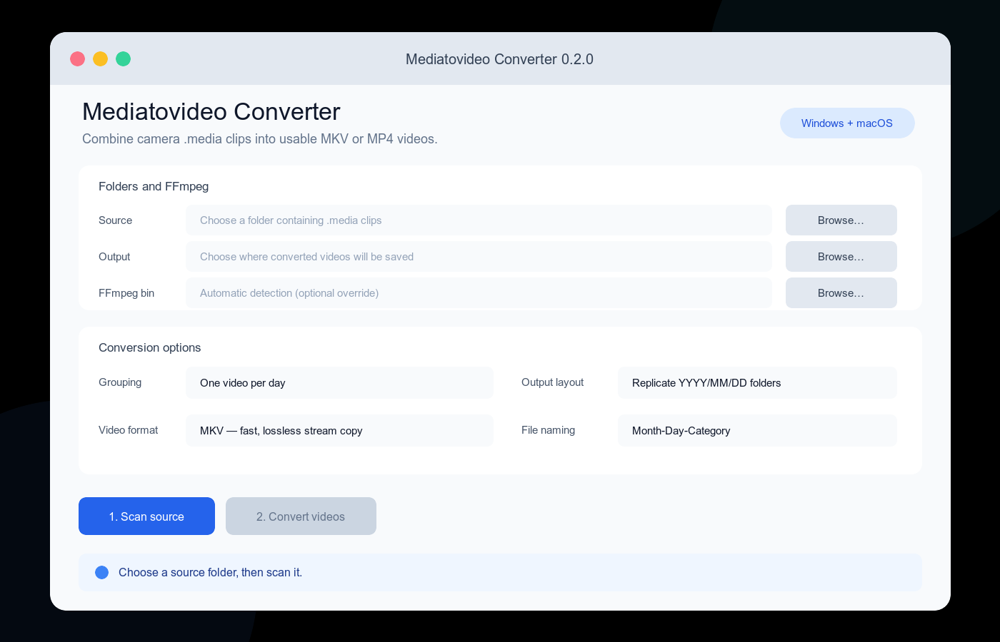
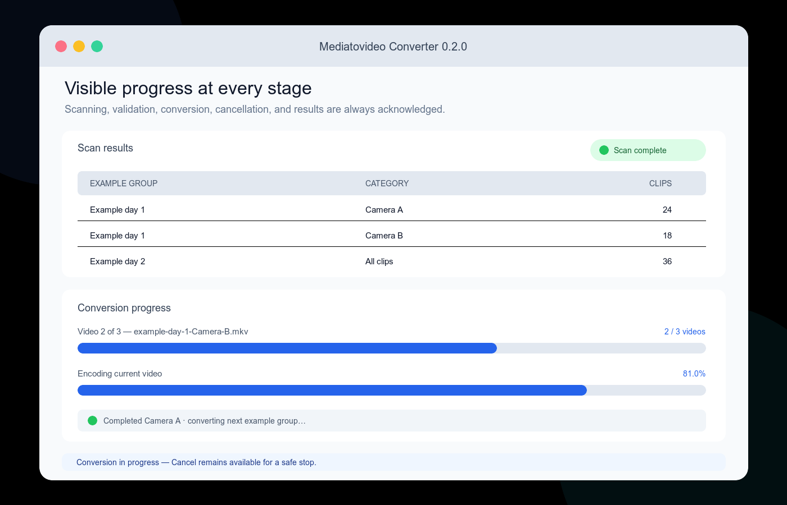

# Mediatovideo Converter

Mediatovideo Converter is a simple Windows and macOS desktop application for
combining camera `.media` clips into usable video files. It expands the
[original FFmpeg concat gist](https://gist.github.com/priintpar/f7a56af8977206e9f45b486f767b02ac)
with folder-aware grouping, validation, progress reporting, cancellation, and a
graphical interface.

## Application renders

The renders below use fictional interface state only. They contain no user
media, filenames, source folders, video frames, or photographs.





## Features

- Select one day folder such as `DCIM/2026/07/17`, or select a higher folder to
  process many `YYYY/MM/DD` day folders in one run.
- Create one video per day or one video for every immediate child folder in a
  day.
- Replicate the `YYYY/MM/DD` structure in the output or put every video in one
  flat folder.
- Name outputs as `07-17` or `07-17-ChildFolder`. Duplicate names receive a
  safe numeric suffix instead of being overwritten.
- Export fast, lossless MKV files with stream copy, or compatible MP4 files
  re-encoded as H.264 video and AAC audio.
- See scanning, clip validation, current-video, and overall conversion progress.
- Cancel a scan or conversion; completed outputs remain intact and partial
  output files are removed.
- Skip unreadable clips and report failures instead of silently doing nothing.
- Check and install missing runtime components from a visible startup terminal.
- Explain failures with clearly labelled stage, problem, recovery action, and
  technical detail sections.

## Automatic first-run setup

The application requires Python 3.9 or newer with Tkinter, FFmpeg, and FFprobe.
The native launchers check these components on every start and install only what
is missing. An internet connection may be required on the first run.

### Windows

Double-click `run_windows.bat`. A terminal remains visible and explains every
check, installation, verification, and error. Missing components are installed
with Windows Package Manager (WinGet):

- the official Python install manager and Python 3.14 with Tkinter;
- the `Gyan.FFmpeg` package, including FFmpeg and FFprobe.

WinGet is included with supported Windows 10 and Windows 11 systems through
Microsoft App Installer. If WinGet is unavailable, the launcher explains how to
install or update App Installer before continuing.

### macOS

Double-click `run_macos.command`. Its Terminal window checks each component and
keeps all installation progress and errors visible. It uses a compatible
existing Python when possible. Otherwise it installs Homebrew, then the
`python-tk` formula. Missing FFmpeg tools are installed with Homebrew.

Homebrew installation may request the Mac administrator password and explains
what it will change before continuing.

### Manual fallback

The same dependencies can be installed manually. On macOS with Homebrew:

```sh
brew install python-tk
brew install ffmpeg
```

On Windows with WinGet and Python's install manager:

```powershell
winget install 9NQ7512CXL7T -e --accept-package-agreements
py install 3.14
winget install --id Gyan.FFmpeg -e
```

Restart the terminal after installation. If FFmpeg is not on the system path,
use the app's optional **FFmpeg bin** selector to choose the folder containing
`ffmpeg` and `ffprobe` (`.exe` on Windows).

## Run from source

On macOS, double-click `run_macos.command`. To bypass the prerequisite launcher
after everything is installed, run:

```sh
python3 run_app.py
```

On Windows, double-click `run_windows.bat`. To bypass the prerequisite launcher
after everything is installed, run:

```powershell
python run_app.py
```

No Python packages are required to run the source version.

## Build a standalone application

Install the optional build dependency and build on each target operating system:

```sh
python -m pip install -e ".[build]"
python scripts/build_app.py
```

PyInstaller writes the app to `dist/`. Build the Windows `.exe` on Windows and
the macOS app on macOS; PyInstaller does not cross-compile between them. FFmpeg
must still be installed separately or selected in the app.

## Output choices

**MKV — fast, lossless stream copy** follows the original gist. It does not
alter the camera streams, so it is quick and preserves source quality. It is
the best first choice for archiving and unusual camera codecs.

**MP4 — compatible H.264** decodes and re-encodes video, which is slower and
lossy but plays on a wider range of devices. The application uses AAC when an
audio stream is available. A proprietary or unrecognised camera audio stream
cannot be recovered merely by changing the container.

Files are sorted by their full relative paths before concatenation. Existing
outputs are never overwritten.

## Tests

```sh
python -m unittest discover -s tests -v
```

The test suite covers date discovery, day/child grouping, fallback layouts,
portable naming, collision handling, FFmpeg orchestration, error clarity, and
both native installer contracts.
